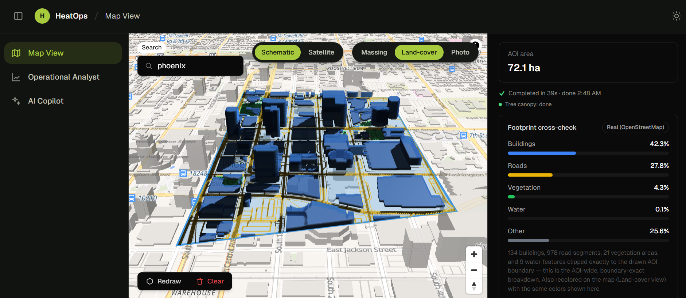
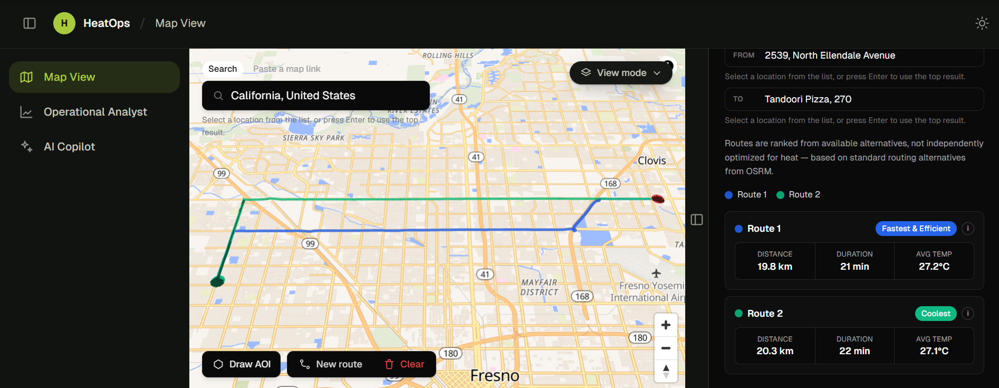
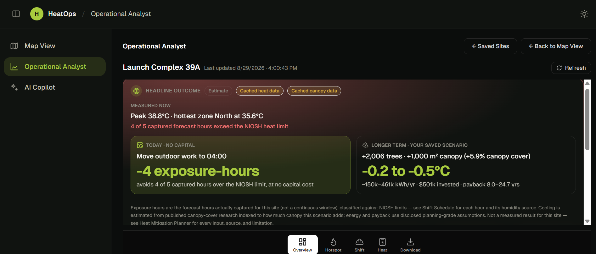
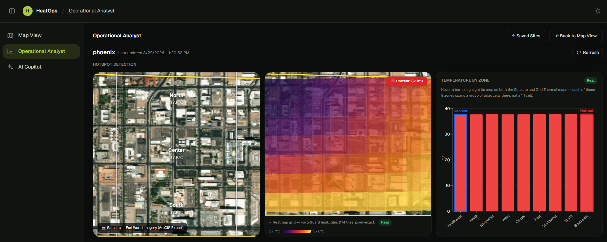
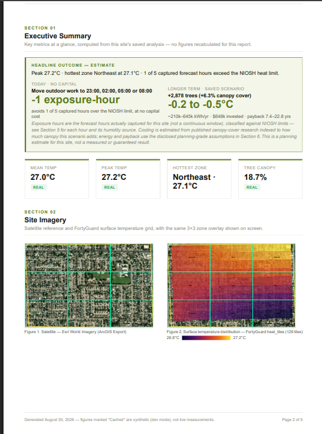
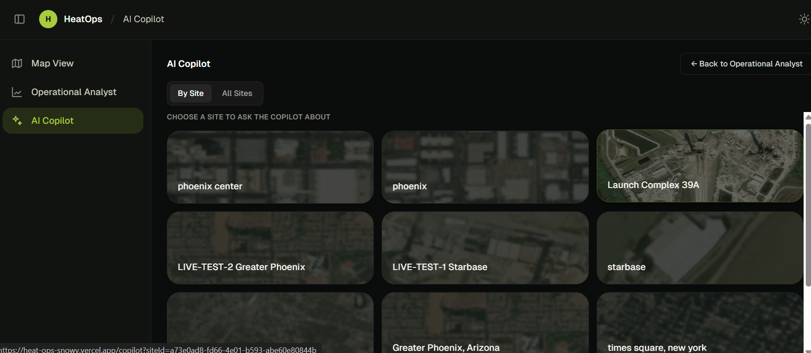

# HeatOps

**Heat-aware site intelligence for industrial operations.**
Built for **FortyGuard Hackathon'26**.

**Live demo:** <https://heat-ops-snowy.vercel.app>

Draw an area on the map, and HeatOps pulls real surface-temperature data from FortyGuard, land cover from OpenStreetMap, and satellite imagery from Esri — then turns it into hotspot detection, worker shift-safety guidance, a cooling-investment simulation, and a PDF report. An AI Copilot sits on top of the same saved data so you can ask questions in plain language.

---

## Table of contents

- [What it does](#what-it-does)
- [Who it's for, and who pays](#who-its-for-and-who-pays)
- [Tech stack](#tech-stack)
- [Getting started](#getting-started)
- [Environment variables](#environment-variables)
- [Database setup](#database-setup)
- [Project structure](#project-structure)
- [API routes](#api-routes)
- [Working with the FortyGuard API](#working-with-the-fortyguard-api)
- [A real API request and response](#a-real-api-request-and-response)
- [What doesn't work yet](#what-doesnt-work-yet)
- [Data honesty rules](#data-honesty-rules)

---

## What it does

HeatOps is three pages, in the order you'd use them.

### 1. Map View (`/map`)



Data acquisition.

- Search a location (Nominatim geocoding) or paste a Google/Apple Maps link
- Draw an AOI polygon on the map (terra-draw)
- On **Analyze**, runs in parallel:
  - **FortyGuard `/v1/heatmap`** → per-tile surface temperature, rendered as a 2D canvas heatmap clipped to your AOI
  - **Overpass (OSM)** → land-cover breakdown (buildings / roads / vegetation / water), clipped exactly to the drawn boundary
  - **FortyGuard `/v1/satellite`** → a centroid spot-check, stored as supporting reference (deliberately *not* shown as an AOI-wide figure — it samples one point, not the whole area)
- **Forecast +12h** — five hourly slots (+0/+3/+6/+9/+12h), fetched automatically right after the block above, concurrently with each other (see *Why forecast capture waits for the main heatmap* below for why it isn't fired at the same instant as that first block)
- 3D building massing (deck.gl) with Schematic / Satellite / Land-cover / Photo view modes
- Saves everything as a **site record** in Supabase, with three generated images
- **Route** — pick an origin and destination (search-as-you-type or click the map, either can set either point), fetch alternatives from OSRM, and compare them by average heat exposure alongside the fastest option



### 2. Operational Analyst (`/analyst`)

Analysis and decisions, reading only the saved site record — no re-fetching, no extra API credits.



| Tab | What it gives you |
|---|---|
| **Overview** | Site info, land cover, heat stats, forecast sparkline, data-provenance badges, hotspot exposure gauge |
| **Hotspot Detection** | Satellite view + pixel-native thermal grid + per-zone bar chart, in a 3×3 compass-labelled grid (Northwest … Southeast), with bidirectional hover cross-highlighting between chart and both maps |
| **Shift Schedule** | WBGT per forecast slot — computed from FortyGuard air temperature **and FortyGuard-measured hourly humidity** (`/v1/env_params`) — classified against NIOSH 2016 Recommended Exposure Limits → safe / caution / danger windows for outdoor work |
| **Heat Mitigation Planner** | Deterministic canopy-deficit recommendation + an editable ROI simulator (trees / canopy / solar → cost, energy saved, payback, break-even chart) |
| **Download PDF** | A print-ready assessment report of everything above |





### 3. AI Copilot (`/copilot`)



A DeepSeek-powered chat with function calling over the saved site data — compare interventions, inspect a zone, generate a report, analyse a field photo. It reads the same computation modules the dashboard uses, so the two can't disagree.

---

## Who it's for, and who pays

**The user.** Operations and HSE (health, safety and environment) leads at industrial and
infrastructure sites with outdoor crews — manufacturing plants, logistics yards, launch
and test facilities, construction and energy sites. One person is typically accountable both
for *when crews work outside* and for *whether a site-cooling budget gets approved*.

**What they do today.** Both decisions are made without site-level data. Heat-stress limits
are published in WBGT, but almost no site has a WBGT sensor grid, so shifts get scheduled by
habit and by whoever complains first. And mitigation spend competes with every other capital
line, where "trees make it cooler" is not a number a finance team can approve.

**What HeatOps sells them.** Two things a site operator can act on from one drawn polygon:

1. **An hour-by-hour exposure record** for the site, computed from FortyGuard temperature and
   FortyGuard-measured humidity and classified against NIOSH limits — the evidence behind a
   scheduling decision, and behind showing that the decision was reasoned.
2. **A costed mitigation case** — canopy area, tree count, estimated cooling, annual kWh, and
   payback — with every assumption disclosed and sourced, so it survives a finance review
   rather than dying in one.

**Why now.** Federal US heat rulemaking is live but unfinished: OSHA published a Notice of
Proposed Rulemaking for *Heat Injury and Illness Prevention in Outdoor and Indoor Work
Settings* in August 2024, held hearings through 2025, and has not published a final standard
or a target date for one. Meanwhile six states — California, Maryland, Minnesota, Nevada,
Oregon and Washington — already enforce their own heat standards, several triggered as low
as 80°F.

Being straight about what that does and does not mean: **Texas, where most of this project's
demo sites sit, has no state heat standard.** For a Texas operator the driver is not a
compliance mandate today — it is liability exposure, lost crew hours, and cooling energy
cost, with a federal standard plausibly arriving later. In the six states that do have one,
the same product is compliance evidence. That is a real difference in sales motion, not a
detail to paper over.

**Shape of the business.** Per-site annual subscription for monitored sites, priced against
the FortyGuard credits each site consumes (one analysis is roughly eight API tasks: whole-day
heatmap, five forecast hours, satellite segmentation, environmental parameters) plus margin;
one-off assessments for consultants running a single study. Multi-site portfolio comparison,
which the Copilot already does, is the natural expansion.

**None of this is built.** There is no billing, no accounts, and no per-organisation data
isolation — see [What doesn't work yet](#what-doesnt-work-yet). Authentication and
multi-tenancy are the first engineering work any of the above depends on. This section
describes the intended commercial model, not a shipped one.

---

## Tech stack

| Layer | Choice |
|---|---|
| Framework | Next.js 14 (App Router) + TypeScript |
| Styling | Tailwind CSS, design tokens in `src/app/globals.css` |
| Map | MapLibre GL JS + Esri World Imagery raster |
| 3D | deck.gl (extruded GeoJSON building massing) |
| Draw tool | terra-draw (+ MapLibre adapter) |
| Geospatial math | Turf.js |
| State | Zustand |
| Database & storage | Supabase (Postgres + Storage) |
| Charts | Recharts (dashboard), hand-drawn SVG (PDF) |
| PDF | `@react-pdf/renderer` |
| AI | DeepSeek (OpenAI-compatible endpoint, function calling) |
| Animation | Framer Motion |

**External data sources:** FortyGuard Temperature API, Overpass API (OpenStreetMap), Esri World Imagery / ArcGIS Export, Nominatim.

---

## Getting started

```bash
npm install
# create .env.local yourself — see Environment variables below
npm run dev
```

Open <http://localhost:3000>. You'll land on Map View.

| Script | Purpose |
|---|---|
| `npm run dev` | Development server |
| `npm run build` | Production build |
| `npm start` | Serve the production build |
| `npm run lint` | ESLint |

Type-check with `npx tsc --noEmit`.

> **Start in cached mode.** Leave `FORTYGUARD_MODE` unset or set to `cached` while developing — it serves fixture data and spends **zero** API credits. Only switch to `live` for a real run.

---

## Environment variables

Create `.env.local` in the project root. **Never commit it** — every key below is server-only except the two `NEXT_PUBLIC_*` ones.

```bash
# --- FortyGuard ---
FORTYGUARD_API_KEY=your_key_here
# "live" is the ONLY value that spends credit. Unset, "cached", or any typo
# falls back to cached fixtures — the safe default for a flag that costs money.
FORTYGUARD_MODE=cached

# --- Supabase ---
SUPABASE_URL=https://<project>.supabase.co
SUPABASE_SERVICE_ROLE_KEY=your_service_role_key   # bypasses RLS — server only
NEXT_PUBLIC_SUPABASE_URL=https://<project>.supabase.co
NEXT_PUBLIC_SUPABASE_PUBLISHABLE_KEY=your_publishable_key

# --- AI Copilot ---
DEEPSEEK_API_KEY=your_deepseek_key
DEEPSEEK_BASE_URL=https://api.deepseek.com/v1
DEEPSEEK_MODEL=deepseek-chat
```

Visit `/api/envcheck` to see — without calling FortyGuard — whether your API key is present and whether the next call will spend credit or return fixtures. (It's a temporary diagnostic route; safe to delete once you no longer need it.)

> Editing `.env.local` while the dev server is running can silently flip FortyGuard into live mode. Re-check the value before any Analyze run.

---

## Database setup

One Postgres table plus one Storage bucket.

**Storage:** create a **public** bucket named `site-photos`. Each saved site writes `<site-id>/satellite.png`, `<site-id>/segmentation.png`, and `<site-id>/heat.png`.

**Table `sites`:**

| Column | Type | Holds |
|---|---|---|
| `id` | uuid (PK) | Minted server-side so the Storage path and row id agree |
| `name` | text | User-entered, or auto-generated from the location |
| `created_at` | timestamptz | Analysis time |
| `aoi_geometry` | jsonb | The drawn GeoJSON Polygon |
| `site_area_m2` | numeric | Turf-computed area |
| `landcover` | jsonb | Overpass breakdown, AOI-wide |
| `landcover_spotcheck` | jsonb | FortyGuard centroid sample (reference only) |
| `heat_tiles` | jsonb | Per-tile lat/lng/temp/bounds |
| `heat_stats` | jsonb | min/mean/max/stddev + `dateUsed`, `isFallbackDate` |
| `heat_forecast` | jsonb | The +0…+12h slots |
| `attribution` | jsonb | `real` / `synthetic` / `unavailable` per data source |
| `satellite_photo_url`, `segmentation_photo_url`, `heat_photo_url` | text | Public Storage URLs |
| `roi_inputs` | jsonb | Saved ROI simulator scenario (nullable) |
| `updated_at` | timestamptz | Set by "Refresh Latest Data" (Operational Analyst); null until a site's first refresh |

If ROI inputs aren't persisting, or "Last updated" always matches the creation date even after clicking Refresh, one of these columns is the usual reason:

```sql
alter table sites add column if not exists roi_inputs jsonb;
alter table sites add column if not exists updated_at timestamptz;
```

Both routes that use these columns degrade gracefully without the migration
(ROI simply doesn't persist; Refresh updates the row's data but can't stamp a
timestamp) rather than failing outright — but the migration is what makes
either feature actually work.

---

## Project structure

```
src/
├── app/
│   ├── map/            Map View
│   ├── analyst/        Operational Analyst
│   ├── copilot/        AI Copilot
│   └── api/            Server routes (all external keys stay here)
├── components/
│   ├── map/            Canvas, draw control, analyze + forecast panels
│   ├── analyst/        Dashboard tabs and cards
│   ├── copilot/        Chat UI
│   ├── layout/         Sidebar, header
│   └── ui/             Shared primitives
├── lib/                Pure logic + API clients (see below)
└── store/              Zustand stores (aoi, analysis, map, draw, ui)
```

Notable modules in `src/lib/`:

| File | Responsibility |
|---|---|
| `fortyguard.ts` | FortyGuard client: submit, poll with backoff, cached/live mode, date fallback |
| `heatmapUtils.ts` | 3×3 zone binning, compass labels, level classification, uniform-field detection |
| `wbgt.ts` | WBGT estimation + NIOSH risk bands + forecast timeline |
| `roiSimulator.ts` | Cost / energy / payback model with disclosed assumptions |
| `heatMitigationRecommendation.ts` | Deterministic canopy-deficit heuristic |
| `reportData.ts` | Single source of truth shared by the PDF route and the Copilot's report tool |
| `pdf/SiteReportDocument.tsx` | The report layout |
| `copilotOrchestrator.ts` / `copilotTools.ts` | DeepSeek tool-use loop |

---

## API routes

| Route | Method | Purpose |
|---|---|---|
| `/api/heatmap` | POST | FortyGuard heatmap (whole-day or a forecast hour) |
| `/api/landcover` | POST | Overpass + FortyGuard satellite, in parallel |
| `/api/satellite/export` | GET | Esri satellite image for an AOI |
| `/api/geocode` | GET | Nominatim forward/reverse geocoding |
| `/api/resolve-map-url` | POST | Turn a pasted map link into coordinates |
| `/api/sites` | POST / PATCH | Create a site record; append forecast slots |
| `/api/sites/[id]` | GET / PATCH / DELETE | Read stored forecast; rename; delete |
| `/api/sites/[id]/roi` | GET / PATCH | Load / save the ROI scenario |
| `/api/sites/[id]/report` | GET | Generate the PDF |
| `/api/copilot/chat` | POST | AI Copilot turn |
| `/api/envcheck` | GET | Confirm required env vars are present |

---

## Working with the FortyGuard API

Behaviours worth knowing before you debug something that isn't actually broken. All of these were confirmed against the live API.

**Three endpoints are used.** `POST /v1/heatmap` (per-tile temperature over the whole AOI
polygon), `POST /v1/satellite` (centroid land-cover segmentation), and `POST /v1/env_params`
(hourly environmental parameters at a point — relative humidity, wet-bulb temperature,
heat index, cloud cover, solar irradiance). All three are async: they return an
`activity_id` you poll via `GET /v1/status/{activity_id}`.

**`/v1/env_params` takes a temperature as INPUT.** It is not another temperature source —
you hand it the temperature you already have (here, FortyGuard's own reading for the AOI)
plus a lat/lon and date, and it returns the surrounding environmental series. With
`filter_type: 3` that is all 24 hours of the day in the location's own timezone, which is
why one call covers every forecast slot. Its `metadata.timestamps` carry that local UTC
offset, so match them to your slots by absolute instant, never by clock-face hour.

**Coverage is US-only.** AOIs outside the United States return no data.

**Async by design.** `POST /v1/heatmap` returns an `activity_id` (nested under `data`); poll `GET /v1/status/{activity_id}` with 3s → 6s → 12s backoff until `Completed`.

**Credits are charged on `Completed`, not on success.** A response that completes with *no usable data* still costs credit. Failed tasks (`status: "Failed"`) don't.

**Hourly requests must land on a whole hour.** `filter_type: 1` data is keyed to `HH:00`. The same AOI and date returns a full tile set at `07:00` and an empty result at `07:15`. Always truncate minutes.

**Today's data often isn't ready.** Availability lags by a variable amount — a day appears to need to be finished *plus* several hours of processing, so the required offset is larger early in the UTC day. It is not a fixed lag, and it isn't location-specific. `runHeatmapWithDateFallback()` handles this: it tries the requested date first, then walks back up to three days, and every result carries the date it actually came from.

**An empty result has its own shape.** Instead of the documented `stats_data`, you get `{ activity_id, n_cells: 0 }` with an empty `map_data.features`. That's the signal to fall back.

**Some fields come back spatially uniform.** For certain AOIs and dates every tile carries an identical temperature, so min = mean = max and the heatmap renders flat. The reading is real, just without spatial detail — larger AOIs generally return more. `isSpatiallyUniform()` detects this so the UI can say so.

**Granularity** is `60 | 80 | 100` metres, chosen from AOI area by `pickGranularity()` to keep tile counts useful. All three are valid; none of them causes the empty-result case.

### Why forecast capture waits for the main heatmap

Map View's Analyze click kicks off two stages, not one flat batch of requests — a deliberate
cost tradeoff, not a missed optimization:

1. **Stage 1 (parallel):** the whole-day heatmap, the Overpass footprint cross-check, and the
   satellite tree-canopy spot-check all fire at once (`src/store/analysisStore.ts`,
   `analyzeAOI()`).
2. **Stage 2 (parallel *within itself*):** all five +12h forecast slots (+0/+3/+6/+9/+12h) are
   then fetched together via `Promise.all` (`captureFullForecast()`) — genuinely concurrent
   with each other, just not with stage 1.

Stage 2 is held back specifically to reuse stage 1's `daysBack` result. As noted above,
today's FortyGuard data is often not ready yet, so `runHeatmapWithDateFallback()` walks
backward up to `MAX_HEATMAP_DAYS_BACK` (3) days looking for one that has data — and
**FortyGuard bills credit on every `Completed` attempt, whether or not it returned usable
tiles.** Stage 1's whole-day call discovers the correct offset once; stage 2 passes it to
every forecast slot as `daysBackHint` (`app/api/heatmap/route.ts`) so each slot's first
attempt already targets a known-good date, instead of every one of the five slots
independently repeating that same up-to-3-day backward search.

Firing all seven requests in one flat batch at t=0 (no `daysBackHint` available yet) would
look faster in the UI, but on a lagged-data day it can multiply forecast-related FortyGuard
credit spend up to ~4x (up to 3 wasted "Completed" attempts per slot, across 5 slots) for a
saving of a few seconds of perceived latency. No FortyGuard concurrency/rate limit was found
in their docs or observed live that would otherwise force this staging — it's purely a
credit-cost decision, made deliberately over full concurrency.

---

## A real API request and response

A genuine, unmodified `/v1/heatmap` exchange — captured 28 August 2026 against an AOI
covering the Houston Ship Channel industrial corridor (Pasadena / Deer Park, Texas),
roughly 51 km². This is exactly the request body `lib/fortyguard.ts` builds.

### 1. Submit — `POST https://api.fortyguard.com/v1/heatmap`

Headers: `api-key: <your key>`, `Content-Type: application/json`

```json
{
  "polygon_aoi": {
    "type": "FeatureCollection",
    "features": [
      {
        "type": "Feature",
        "properties": {},
        "geometry": {
          "type": "Polygon",
          "coordinates": [[
            [-95.16, 29.69], [-95.08, 29.69], [-95.08, 29.75],
            [-95.16, 29.75], [-95.16, 29.69]
          ]]
        }
      }
    ]
  },
  "date_time": { "start_date": "2026-08-26", "filter_type": 3 },
  "granularity": 100
}
```

Response:

```json
{
  "error": false,
  "status_code": 200,
  "message": "Heatmap Submitted Successfully",
  "data": { "activity_id": "67ee28fa-9afc-4d19-965d-536f1c590989" }
}
```

### 2. Poll — `GET https://api.fortyguard.com/v1/status/{activity_id}`

Returned `"status": "Processing"` at +3s and +6s, then `"Completed"` at +12s — the
3s → 6s → 12s backoff the client uses. The completed payload was 1.88 MB containing
**4,835 tiles**; `map_data.features` and the distribution arrays are truncated below
for readability. Everything else is verbatim.

```json
{
  "error": false,
  "status_code": 200,
  "message": "Completed",
  "data": {
    "activity_id": "67ee28fa-9afc-4d19-965d-536f1c590989",
    "status": "Completed",
    "result": {
      "map_data": {
        "type": "FeatureCollection",
        "features": [
          {
            "id": "0",
            "type": "Feature",
            "properties": {
              "tile_id": 0,
              "average_temperature": 31.8584,
              "min_temperature": 26.7176,
              "max_temperature": 37.2593
            },
            "geometry": {
              "type": "Polygon",
              "coordinates": [[
                [-95.10156227482021, 29.689555139378445],
                [-95.10052487916587, 29.689571598494993],
                [-95.10054354954454, 29.690468937035096],
                [-95.10158095440318, 29.690452477322435],
                [-95.10156227482021, 29.689555139378445]
              ]]
            }
          }
        ]
      },
      "stats_data": {
        "temperature_stats": {
          "minimum": 31.3941,
          "maximum": 33.3298,
          "mean": 32.40325288521199,
          "standard_deviation": 0.4193647578883087
        },
        "overall_temperature_distribution": [31.3941, 32.33045, 32.4547, 32.5387, 33.3298],
        "normal_temperature_distribution": {
          "x_axis": [31.145158611547064, 31.17057465747969, 31.195990703412313],
          "y_axis": [0.010568003935891844, 0.012651965444127151, 0.015091340675480146]
        },
        "temperature_frequency": {
          "x_axis": [32.0, 33.0, 31.0],
          "y_axis": [3262, 1517, 56]
        }
      }
    }
  }
}
```

Two things worth noting against the published docs: `stats_data` keys come back
lowercase snake_case (`temperature_stats.minimum`), not the capitalized
`Temperature_stats.Minimum` the prose describes; and each feature carries a
top-level `"id"` alongside `properties.tile_id`.

Binning these 4,835 tiles into HeatOps’ 3×3 zone grid puts the hottest zone in the
**Northeast** (mean 32.91 °C), with the single hottest tile at 33.33 °C near
29.7464, -95.1105 — the Ship Channel itself.

---

## What doesn’t work yet

Honest limitations, so you know what you’re looking at.

- **No authentication or multi-tenancy.** Every visitor sees — and can delete — every
  saved site. The server uses Supabase’s service-role key and bypasses RLS. This is the
  first thing that needs to change before real use.
- **United States only.** AOIs outside the US return no data — a FortyGuard coverage
  constraint, not a product choice.
- **Same-day heat data is often unavailable.** FortyGuard’s availability lag is variable,
  so an analysis run today usually falls back to an earlier date. The app handles this and
  always names the date it actually used, but “today’s reading” is frequently not
  obtainable.
- **Some AOIs return a spatially uniform field.** Every tile carries the same temperature,
  so the heatmap renders flat. The reading is real, just without spatial detail. Larger
  AOIs generally return more.
- **Tree canopy comes from a single centroid spot-check**, not an AOI-wide segmentation,
  and for some sites FortyGuard returns no distinct “Tree” class at all — those sites get
  no canopy recommendation rather than a guessed one.
- **The ROI model is planning-grade, not an energy audit.** The kWh-per-m²-per-°C figure is
  derived, not directly measured, and the canopy-to-cooling range comes from studies that
  tested up to ~30 percentage points of canopy change; scenarios beyond that are flagged
  as extrapolation.
- **WBGT is derived, not measured.** Relative humidity IS now real — FortyGuard's
  `/v1/env_params` supplies an hourly series and each forecast slot uses the reading for
  its own hour — but wind speed and radiant heat are still unavailable, so a shade
  approximation is used rather than a full outdoor WBGT. Sites saved before this existed,
  and any hour with no reading, fall back to a fixed 40% and are labelled `Assumed`.
  Risk bands remain a NIOSH-based screening estimate, not a certified individual safety
  assessment.
- **Saved sites are capped at 60** and not paginated.
- **Mobile and tablet layouts are newly fixed and lightly tested** — the app is built for a
  desktop operator workflow.
- **The AI Copilot needs a DeepSeek key.** Without one the dashboard still works fully; the
  chat and the PDF’s narrative section degrade to an explicit “unavailable” message rather
  than failing.
- **Refresh Latest Data updates numbers, not saved snapshot images.** It re-runs the
  heatmap/land-cover/forecast calls against the site’s existing AOI and updates every tab
  from one canonical row, but the three saved photos (satellite, heatmap, segmentation)
  are rendered client-side during Map View’s own Analyze flow — a server route has no
  canvas to re-render them from. They only update by re-analyzing from Map View.
- **Refresh has no server-side duplicate-request lock** — only a disabled button while one
  run is in flight. Fine for this app’s actual single-operator usage; a genuine concurrent-
  refresh guard would need a lock column or similar, not built here.

---

## Data honesty rules

These are non-negotiable in this codebase, and worth keeping if you extend it:

1. **Never fabricate a measurement.** A slot with no data stays visibly unavailable — never interpolated, never filled from a neighbour.
2. **Never present older data as current.** When a request falls back to an earlier date, every surface that displays it — dashboard, Map View, PDF — names the real date and says it isn't a forecast.
3. **Label provenance everywhere.** `Real` / `Cached` / `N/A` badges reflect where each number actually came from, and cached (fixture) values say so explicitly.
4. **Compute once, reuse.** Zone binning, WBGT, ROI, and recommendations live in single shared modules so the dashboard, the PDF, and the Copilot can never disagree.

---

Built for FortyGuard Hackathon'26 · Data © FortyGuard, OpenStreetMap contributors, Esri.
